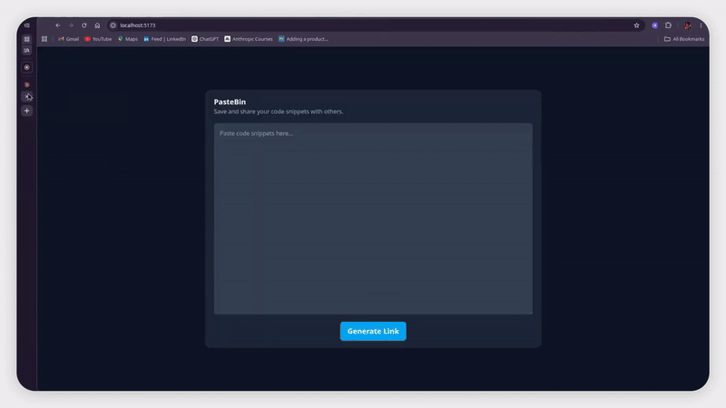
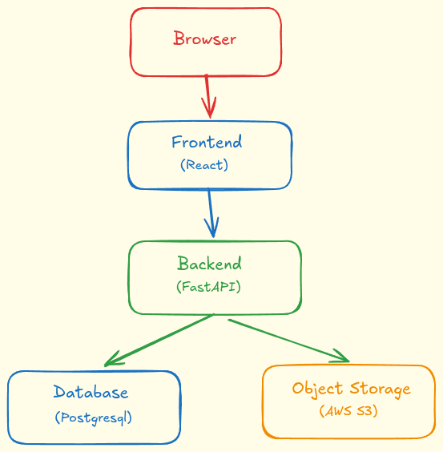
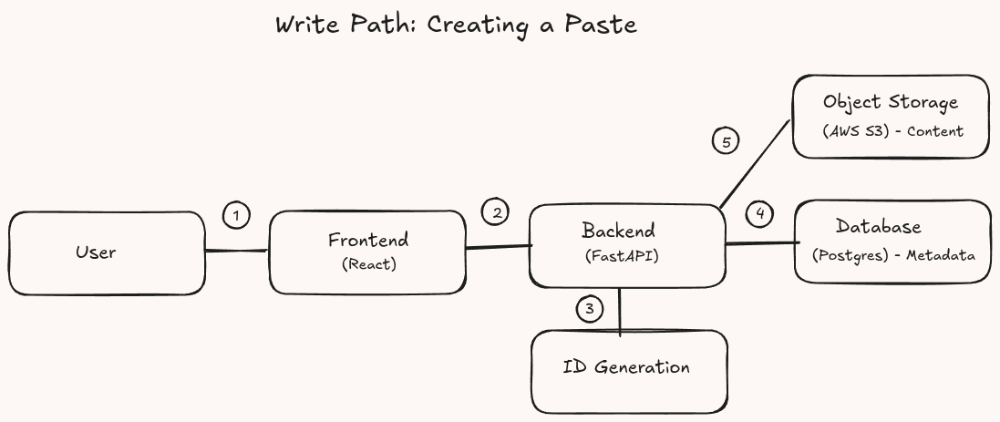
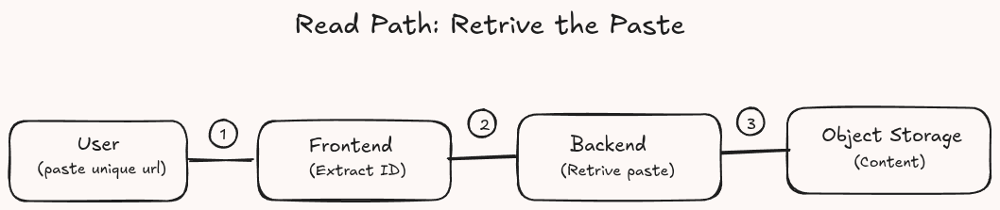

# PASTEBIN

Pastebin is a full-stack application designed to store code snippets, errors logs, and other text-based content and convert them into shareable URLs. A developer debugging a production issue encounters errors, can use Pastebin to copy the error logs, and convert them into unique shareable URLs. They can then post or share this URL with others to get help from other developers who may have encountered the same issue.


## Demo

Click here to see live demo: [Live Demo](https://pastebin-ivory.vercel.app/)
> [!NOTE] 
> The demo may take 15–20 seconds to start because the backend is hosted on a free-tier service.




## Tech Stack

- [FastAPI](https://fastapi.tiangolo.com/) for python backend API.
- [React](https://reactjs.org/) for frontend UI.
- [PostgreSQL](https://www.postgresql.org/) as a primary database for saving paste metadata.
- [AWS S3](https://aws.amazon.com/s3/) for storing paste content.
- [Docker Compose](https://docs.docker.com/compose/) for local development.
- [Vercel](https://vercel.com/) for hosting the frontend.
- [Render](https://render.com/) for hosting the backend and PostgreSQL database.


## Getting Started

### Prerequisites (For Local Development)

You need to have the following installed on your machine:

- Docker & Docker Compose
- An AWS account & AWS CLI Configured
- A remote AWS S3 Bucket

### Installation

1. Clone and navigate to the repository:

   ```bash
   git clone https://github.com/pastebin.git
   cd pastebin
   ```

2. Create a secrets file for postgresql password:

   ```bash
   mkdir -p core/secrets/postgresql
   echo "mypassword" > core/secrets/postgresql/credential
   ```

> [!NOTE]
> Replace `mypassword` with password of your choice, do not change any folder or file names.

3. AWS Configurations:
  - Pastebin uses AWS S3 for object storage. Follow the [AWS Local Setup](docs/aws-local-setup.md) to configure the required IAM permissions and AWS CLI profile.

4. Run the application:

   ```bash
   docker compose up --build --watch
   ```

5. Open the application:

  - Application is available at `http://localhost:5173`.
  - Backend API docs are available at `http://localhost:8080/docs`.


## Architecture Overview

### High-Level Overview



The system separates concerns:
- **Frontend**: Handles user interactions and displays the UI.
- **Backend**: Manages the business logic and data persistence.
- **Database**: Stores paste metadata.
- **Object Storage**: Stores paste content.

### Creating a Paste

Users upload text content. The system generates a unique short URL and persists the text. The URL is returned immediately for sharing.



1. User pastes 50 lines of error logs and clicks "Generate Link".
2. Frontend renders UI and sends the data to the backend.
3. Backend receives the text data and generates a unique id for the paste.
4. Backend stores the paste metadata in PostgreSQL. If the operation fails, an error is returned.
5. Backend stores the paste content in AWS S3. If the operation fails, the previously stored metadata is deleted and an error is returned.
6. User receives back a unique URL and can share it with others.

### Retrieving a Paste

Users can retrieve pastes using the unique URL generated during creation.



1. User enters the unique URL into the browser and frontend receives the URL.
2. Frontend extracts the unique id from the URL and sends a request to the backend.
3. Backend obtains the text content from AWS s3 object storage and returns it to the frontend.
4. Frontend renders the UI and displays the text content to the user.


## API Documentation

The API documentation is available through FastAPI's Swagger UI at [Docs](https://pastebin-0axv.onrender.com/docs).

> [!NOTE]
> This may also take a few minutes to load.


## Project Structure

```text
.
├── .docker
│   └── aws
│       ├── config                  # AWS config for docker compose
│       └── credentials             # AWS credentials for docker compose
├── compose.yaml                    # Docker Compose configuration for local dev
├── core
│   ├── app
│   │   ├── config.py               # Application, database and aws s3 configuration
│   │   ├── database.py             # Database engine and session configuration
│   │   ├── dependencies.py         # Dependency configuration
│   │   ├── main.py                 # Application entry point
│   │   ├── models.py               # Database models
│   │   ├── routers                 # API routers for pastebin routes
│   │   ├── schemas.py              # Pydantic schemas
│   │   ├── service.py              # Business logic for pastebin routes
│   │   ├── storage                 # Storage layer for s3
│   │   └── utils.py                # Utility functions
│   ├── dev.Dockerfile              # Development Dockerfile
│   ├── prod.Dockerfile             # Production Dockerfile
│   ├── pyproject.toml              # Project configuration
│   ├── README.md                   # Backend README
│   ├── secrets
│   │   └──postgresql
│   │       └── credential          # PostgreSQL database password credential
│   │
│   ├── tests
│   │   ├── test_bucket.py          # Test bucket operations
│   │   └── test_service.py         # Test service layer
│   └── uv.lock                     # Lock file for dependencies
├── frontend
│   ├── dev.Dockerfile              # Development Dockerfile
│   ├── eslint.config.js            # ESLint configuration
│   ├── index.html                  # Entry point HTML
│   ├── package.json                # Package configuration
│   ├── package-lock.json           # Package lock file
│   ├── prod.Dockerfile             # Production Dockerfile
│   ├── README.md                   # Frontend README
│   ├── src
│   │   ├── api.js                  # API request handling
│   │   ├── App.jsx                 # Main application component
│   │   ├── assets
│   │   ├── components              # React components
│   │   ├── index.css               # Global styles
│   │   ├── main.jsx                # Entry point for the application
│   ├── vercel.json                 # Vercel configuration
│   └── vite.config.js              # Vite configuration
└── README.md                       # Project README
```


## Contributing

We welcome contributions from developers who want to improve Pastebin
Follow these steps to contribute effectively:

1. **Set Up Local Environment**

    - Follow the Getting Started instructions to configure Postgresql and AWS credentials.

2. **Create a Feature Branch**

    - Use `feature/<name>` branch to develop your feature and submit it through a Pull Request for CI checks and code review:

    ```bash
    git checkout -b feature/your-feature-name
    ```

3. **Use Clear Commit Messages**

    - Commit messages must follow the conventional commit style because the automated release process uses commit messages to determine version changes, check out [Conventional Commits](https://www.conventionalcommits.org/en/v1.0.0/) for more information on the commit message format:
        - feat: - new feature
        - fix: - bug fix
        - BREAKING CHANGE: - new changes that are not backward-compatible
        - docs: - documentation update
        - refactor: - code restructuring

    - Document Your Changes
        - Update README.md or CONTRIBUTING.md if needed

4. **Submit your PR and participate in code review**

    - Push your branch and open a Pull Request with:

        - A short, clear description of your changes.
        - Any related issue numbers (for example, "Closes #12").
        - Screenshots or example outputs (if applicable)
        - Respond to feedback, make improvements, and help maintain project quality.

## License

This project is licensed under the MIT License.
